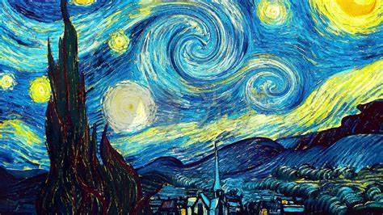
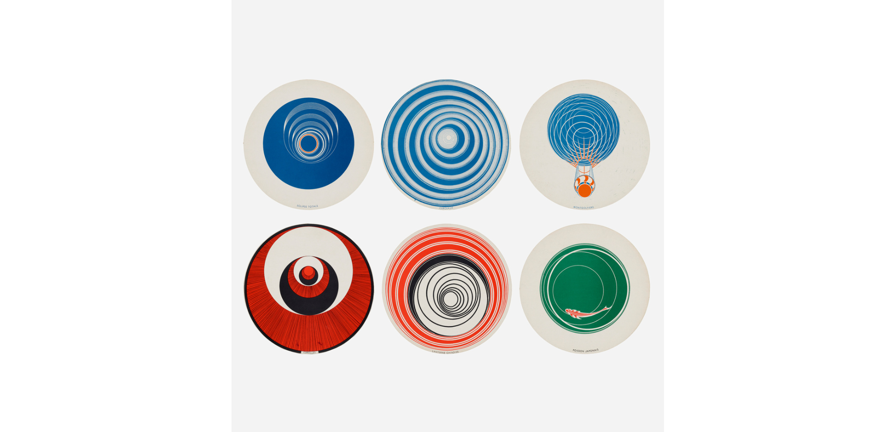

Quiz 8 – Imaging & Coding Inspiration

## Part 1: Imaging Technique Inspiration

**Chosen Technique**
> I’m inspired by Van Gogh’s Starry Night and Marcel Duchamp’s Rotoreliefs (1935). I want to borrow the swirling strokes and paint dots from Van Gogh, and the off-centered spinning patterns from Duchamp’s discs.

**Why I Chose It**  
> My “Wheels of Fortune” is made of painterly textures and circles. Animating these with swirling and off-centered motion makes the spin elegant and lively—like Starry Night in motion.

**Screenshots**  

---

## Part 2: Coding Technique Exploration

**Coding Method**: [e.g., “Parallax effect using p5.js mouse scroll”]

**How It Helps**  
> This code shows how to create a parallax illusion using p5.js. It would help add interactive depth to my design when users scroll or hover.

**Screenshot**  

**Example Code Link**  
[rococo oil painting on the GPU by clnrrr](https://editor.p5js.org/clnrrr/sketches/bdlGB5IpJ)
